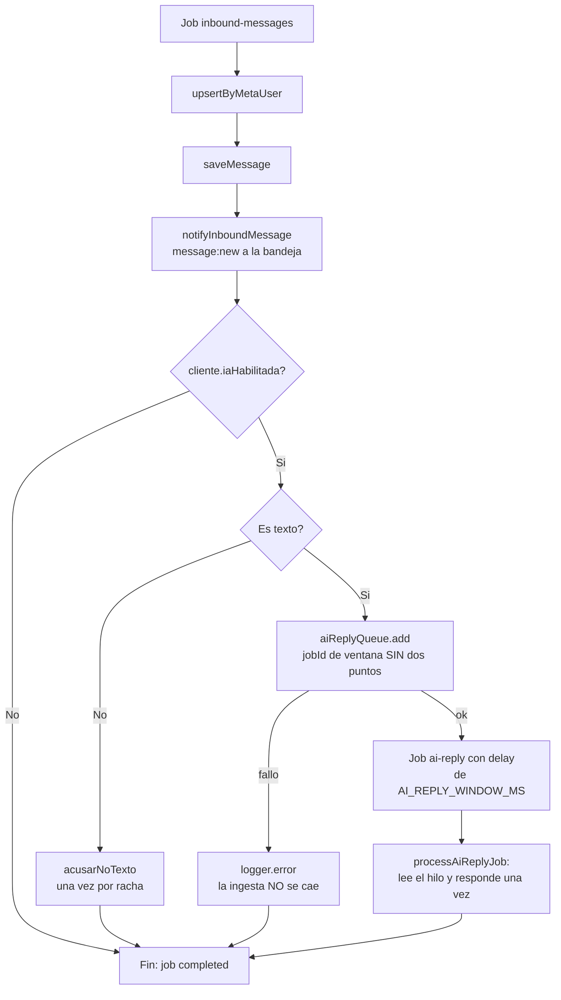

# HT-AI-02 — El auto-reply nunca se encola: `jobId` con dos puntos (spec)

> **Spec-Driven Development.** Este es el QUÉ y el porqué. El CÓMO va en `plan.md`; la ejecución en
> `tasks.md`. Corrección sobre `HU-IA-02`, que construyó la ventana de agrupación: el diseño es
> correcto y el identificador que lo implementa usa un carácter que BullMQ rechaza.
>
> **Rama:** se trabaja sobre `feat/HU-IA-01`, la rama viva de las historias de IA/KB. **No** se crea
> rama nueva.

**Estado:** implementado

## Síntoma reportado

> Enviar y recibir por WhatsApp ya funciona: los mensajes entran en la bandeja y puedo responder a
> mano. Pero **Sofi no contesta sola** — ni responde, ni acusa recibo de un audio, ni avisa de un
> fallo. En cambio el **resumen de conversación por IA sí funciona**.

Esas tres observaciones juntas señalan un sitio muy concreto: no es Gemini, no son las credenciales
y no es el webhook. Es el salto a la cola.

## Causa raíz

`ventanaJobId` construye el identificador de la ventana de agrupación con **dos puntos**, y BullMQ
los rechaza en un `jobId` personalizado.

| # | Dónde | Qué pasa |
|---|---|---|
| 1 | `inbound-message.processor.ts:49` | Devuelve `` `ai-reply:${tenantId}:${clienteId}:${ventana}` `` |
| 2 | `inbound-message.processor.ts:168` | Ese valor se pasa como `jobId` a `aiReplyQueue.add` |
| 3 | `bullmq/dist/cjs/classes/job.js:1047-1050` | `validateOptions` lanza `Error: Custom Id cannot contain :` |
| 4 | — | La excepción sube por `atenderConSofi` → `processInboundJob` → el worker de inbound, que marca el job como `failed`. **El `ai-reply` no llega a existir** |

**Confirmado en la fuente instalada** (bullmq 5.79.2) y contra la evidencia de Redis: la cola
`ai-reply` está en cero absoluto —0 completed, 0 failed, 0 delayed, 0 wait, 0 active: nunca se
encoló nada— mientras `inbound-messages` acumula 5 jobs en `failed`, todos con
`reason = "Custom Id cannot contain :"`.

### El matiz que cambia el arreglo

La validación no prohíbe los dos puntos sin más:

```js
if (jobId.includes(':') && jobId.split(':').length !== 3) {
  throw new Error('Custom Id cannot contain :');
}
```

Solo lanza si hay `:` **y** el id no tiene exactamente 3 tramos — una rama de compatibilidad con
los repeatable jobs antiguos que el propio comentario del código marca como `TODO: replace this
check in next breaking check with include(':')`.

Nuestro id tiene 4 tramos, así que revienta. Pero significa que **quitar un solo dos puntos lo
haría pasar por accidente**, apoyado en una compatibilidad que BullMQ ya anunció que va a eliminar.
El arreglo tiene que quitar **todos** los dos puntos, no ajustar el conteo a tres.

### Por qué la bandeja sí recibe

`processInboundJob` ejecuta en orden: `upsertByMetaUser` → `saveMessage` →
`notifyInboundMessage` (líneas 113-129) y **solo después** el `if (cliente.iaHabilitada)` de la
línea 131. Cuando estalla, el mensaje ya está guardado y ya se emitió `message:new`. El usuario ve
llegar el mensaje y no ve nada de lo que vino detrás.

### Por qué el resumen sí funciona

`generateConversationSummary` llama a `getAIService().summarize(...)` de forma síncrona en el
proceso web. No pasa por BullMQ ni por `ventanaJobId`, así que no comparte la ruta rota. Es la
prueba de que Gemini y las credenciales están bien.

### Por qué los tests no lo cazaron

`inbound-message.processor.test.ts:15-24` mockea `../config/queues.js` y sustituye `aiReplyQueue`
por `{ add: vi.fn() }`. Ese doble acepta cualquier cosa: nunca ejecuta `validateOptions`. La suite
cubre bien la **semántica** del id —idempotencia por ventana, separación por cliente y por tenant,
líneas 269-296— y su **contenido** (línea 246, `toContain(tenantId)`), pero no cubre lo único que
BullMQ realmente exige: el juego de caracteres. Es un contrato del proveedor, y contra un mock no
se puede verificar.

### Alcance del daño: exactamente un sitio

`jobId` personalizado se usa en **un solo punto de todo el backend**
(`inbound-message.processor.ts:168`). Ni `kb-index`, ni `outbound-send`, ni las campañas pasan
`jobId`: usan el autoincremental de BullMQ. No hay más instancias latentes de este bug.

## Objetivo

1. Que el auto-reply vuelva a encolarse, conservando intacta la agrupación por ventana de
   `HU-IA-02`: mismo tenant + mismo cliente + misma ventana → mismo `jobId` → una sola respuesta
   para toda la ráfaga.
2. Que un fallo al encolar **no tumbe la ingesta**, que ya terminó su trabajo principal.
3. Que exista una prueba que valide el `jobId` contra el contrato real de BullMQ y no contra un
   mock complaciente.

## Alcance

### Incluye

- `ventanaJobId` deja de usar `:` como separador, sin cambiar la identidad de la ventana.
- `atenderConSofi` deja de poder tumbar `processInboundJob`: su fallo se registra en `error` y la
  ingesta se completa.
- Tests de regresión: el formato del `jobId` frente a las dos reglas de BullMQ, y el aislamiento
  del fallo.
- Instrucciones operativas para descartar los 5 jobs varados y comprobar que una ráfaga nueva
  encola bien.

### Fuera de alcance

- **Rediseñar la ventana de agrupación.** Las ventanas fijas, el `delay`, el `attempts: 1` y la
  guarda de `processAiReplyJob` son decisiones de `HU-IA-02` y siguen siendo correctas.
- **Reprocesar los 5 jobs fallidos.** Se descartan: los mensajes están en Mongo y en la bandeja, y
  hacer que Sofi conteste hoy a un mensaje de hace días es peor para el prospecto que el silencio.
  El asesor puede responderlos a mano.
- Tocar `ai-reply.processor.ts`, `AI_REPLY_WINDOW_MS`, el webhook o el resumen conversacional.
- Migrar jobIds existentes: la cola `ai-reply` está vacía, no hay nada que migrar.

## Criterios de aceptación

1. **El `jobId` no contiene `:`.** `ventanaJobId` devuelve un identificador sin dos puntos, para
   cualquier combinación de entradas. No se busca «tener tres tramos»: se busca no tener ninguno.

2. **BullMQ lo acepta.** El identificador pasa las dos reglas de `validateOptions`: no contiene `:`
   y no es un entero puro (el prefijo no numérico lo garantiza).

3. **La agrupación de HU-IA-02 sigue igual:** mismo tenant + mismo cliente + misma ventana → mismo
   id; ventana siguiente, cliente distinto o tenant distinto → id distinto. Los cuatro casos que ya
   cubre `describe('ventanaJobId — aislamiento y agrupación')` siguen verdes **sin cambiar su
   intención**.

4. **Una ráfaga produce una sola respuesta:** tres mensajes seguidos del mismo cliente en la misma
   ventana siguen compartiendo un único `jobId`.

5. **Un fallo al encolar no tumba la ingesta:** si `atenderConSofi` lanza, `processInboundJob`
   termina bien —el mensaje ya está guardado y notificado— y el fallo queda registrado en nivel
   `error`, con `tenantId` y `clienteId`.

6. **El acuse de no-texto no cambia:** un audio sigue recibiendo `MENSAJE_SOLO_TEXTO` una sola vez
   por racha, y `iaHabilitada: false` sigue sin encolar ni acusar.

7. **La prueba verifica el contrato real, no el mock.** Existe un test que comprueba el `jobId`
   contra las reglas de BullMQ de forma que un mock permisivo no lo pueda dejar pasar.

8. **Aislamiento multi-tenant (severidad máxima):** el `tenantId` sigue por delante en el
   identificador, así que dos clientes con el mismo `_id` en empresas distintas nunca comparten
   ventana. `processInboundJob` sigue resolviendo el tenant por `phone_number_id` —la excepción
   documentada del webhook— y todas sus lecturas siguen pasando por `findScoped`. **Test de
   aislamiento:** el mismo `clienteId` bajo dos tenants produce ids distintos.

9. **Verde:** `pnpm --filter @sofiapp/api typecheck` (`tsc --noEmit`) y
   `pnpm --filter @sofiapp/api test` en verde. Cero `any`, tipos de retorno explícitos.

## Camino del entrante



Antes del arreglo, el flujo moría en `H`: la excepción subía hasta el worker y el job quedaba en
`failed`, con el mensaje ya guardado y notificado en `C` y `D`.

## Dependencias

- **Depende de:** `HU-IA-02` (la ventana de agrupación y el auto-reply), `HT-WA-01` y `HT-WA-02`
  (el webhook, ya funcionando: sin entrantes no hay nada que auto-responder).
- **Requiere infraestructura:** ninguna nueva. Sí exige, como paso operativo, descartar los jobs
  varados en `inbound-messages` y reiniciar el worker.
- **Desbloquea:** el auto-reply completo, y con él el acuse de no-texto, la semaforización
  automática (`HU-IA-05`) y la extracción de datos (`HU-IA-06`), que cuelgan del ciclo de
  `processAiReplyJob` y **nunca se han ejecutado con tráfico real**.
