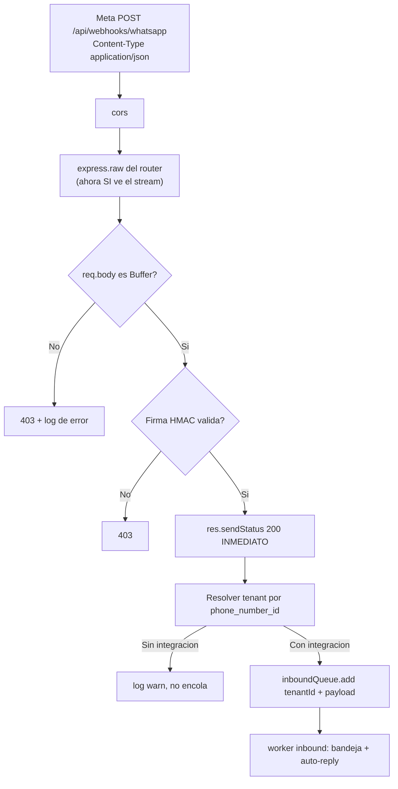

# HT-WA-02 — El webhook de WhatsApp nunca procesa un entrante (spec)

> **Spec-Driven Development.** Este es el QUÉ y el porqué. El CÓMO va en `plan.md`; la ejecución en
> `tasks.md`. Corrección sobre `HT-WA-01`, que construyó el webhook: el feature está bien diseñado
> y llegó roto a producción por un middleware global que se le adelanta.
>
> **Rama:** se trabaja sobre `feat/HU-IA-01`, la rama viva de las historias de IA/KB. **No** se crea
> rama nueva.

**Estado:** implementado

## Síntoma reportado

> Desde la bandeja envío mensajes y me llegan al WhatsApp. Pero cuando **yo** respondo desde el
> teléfono, no aparece nada en la bandeja y la IA no contesta.

La asimetría es la pista: el outbound no pasa por el webhook, así que funciona; el inbound depende
enteramente de él, y el webhook está roto **de extremo a extremo** — nunca ha procesado un evento.

## Causa raíz

Un middleware global se come el cuerpo de la petición antes de que la ruta del webhook pueda leerlo
crudo, que es lo único con lo que se puede validar la firma HMAC de Meta.

| # | Dónde | Qué pasa |
|---|---|---|
| 1 | `app.ts:43` | `app.use(express.json())` se aplica **globalmente** |
| 2 | `app.ts:64` | El webhook se monta **21 líneas después** |
| 3 | — | Meta manda `Content-Type: application/json`, así que `express.json()` consume el stream y deja `req.body` como objeto JS |
| 4 | `webhook.routes.ts:9` | El `express.raw({ type: 'application/json' })` de la ruta llega tarde: el cuerpo ya se leyó, y no puede sustituir `req.body` por un `Buffer` |
| 5 | `webhook.controller.ts:22` | `const rawBody = req.body as Buffer` — la aserción es falsa en tiempo de ejecución |
| 6 | `webhook.service.ts:22` | `createHmac('sha256', secret).update(rawBody)` con un objeto → `TypeError [ERR_INVALID_ARG_TYPE]` |
| 7 | `webhook.routes.ts:10-12` | El `.catch` solo hace `console.error`: **no se responde nada** → Meta reintenta y acaba desactivando la suscripción |

Ese `as Buffer` de la línea 22 es lo que deja pasar el bug por `tsc`: es la única pieza que sostiene
todo el camino, y nada en tiempo de ejecución la respalda.

### Dos agravantes

1. **La excepción no queda contenida.** En `webhook.service.ts:20-28` el `try/catch` abre en la
   línea 23, *después* del `createHmac` de la 22, así que solo protege el `timingSafeEqual`. Con una
   línea de diferencia, la función devolvería `false` y Meta recibiría un `403` limpio en vez de
   silencio: sería un bug ruidoso en lugar de invisible.
2. **Hay una segunda causa posible con el mismo síntoma.** `config/env.ts` declara
   `META_APP_SECRET: z.string().optional()`. Si falta en el despliegue, `webhook.service.ts:21`
   devuelve `false` de entrada y **todo webhook recibe 403**, sin ruido, y eso sobrevive a la
   corrección del orden.

### Descartado

- **`csrfGuard` no interviene:** `csrf.middleware.ts:6` ya exime `/api/webhooks/`.
- **`cors` y `cookieParser` tampoco:** `cors` seguirá por delante del nuevo montaje y el webhook no
  necesita cookies.
- **Los límites de tamaño no cambian:** `express.json()` y `express.raw()` comparten el mismo
  default de 100 kb.

### Por qué los tests no lo cazaron

`tests/unit/webhook.service.test.ts:17` construye el `Buffer` a mano y llama a
`validateHmacSignature` directamente. Nunca cruza la capa HTTP, que es exactamente donde vive el
bug. Ningún test levanta `app` contra el webhook.

## Objetivo

1. Que un evento real de Meta llegue a la cola `inbound-messages`, y de ahí a la bandeja y al
   auto-reply.
2. Que el webhook **siempre** responda algo a Meta. Una petición colgada es la mitad del daño: causa
   la tormenta de reintentos y no deja rastro que permita diagnosticar.
3. Que la falta de `META_APP_SECRET` deje de ser una trampa silenciosa.

## Alcance

### Incluye

- Reordenar `app.ts` para montar el webhook antes de `express.json()`.
- Endurecer la cadena del webhook para que ningún camino termine sin respuesta: guarda de `Buffer`
  en el controller, `createHmac` dentro del `try` en el service, y respuesta en el `.catch` de la
  ruta.
- Aviso al arrancar el proceso web si `META_APP_SECRET` no está configurada.
- Test de regresión **a nivel HTTP** del webhook, que es el único que habría detectado esto.

### Fuera de alcance

- **Rediseñar el webhook.** El feature está bien: responde `200` inmediato, delega a BullMQ y
  resuelve el tenant por `phone_number_id`. No se toca esa estructura.
- Cambiar `express.json({ verify })` a nivel de app para capturar el cuerpo crudo de toda la API
  (ver `plan.md`: evaluado y descartado).
- Tocar el `inbound-message.processor`, la bandeja, el auto-reply o el outbound.
- Hacer `META_APP_SECRET` obligatoria: rompería los despliegues que no usan WhatsApp.
- Reintentos, verificación de `entry.id` o deduplicación de eventos de Meta.

## Criterios de aceptación

1. **El cuerpo llega crudo:** en `app.ts`, `/api/webhooks/whatsapp` se monta **antes** de
   `express.json()` y después de `cors`. El `express.raw({ type: 'application/json' })` de
   `webhook.routes.ts` vuelve a ser el que llena `req.body`, con un `Buffer`.

2. **Entrante válido → 200 y job encolado:** un `POST` con `Content-Type: application/json` y una
   firma `X-Hub-Signature-256` correcta sobre esos mismos bytes responde `200` y encola en
   `inboundQueue` un `{ tenantId, payload }` con el tenant resuelto por `phone_number_id`.

3. **Firma inválida o ausente → 403**, sin encolar nada y sin colgarse.

4. **Cuerpo inesperado → 403, nunca una excepción:** si `req.body` no es un `Buffer` —la huella
   exacta de este bug— el controller responde `403` y lo registra en `error`. `validateHmacSignature`
   degrada a `false` ante cualquier entrada rara en vez de propagar.

5. **Meta nunca se queda sin respuesta:** ningún camino del webhook termina sin enviar un código. Si
   algo falla antes de responder, se contesta; si falla después del `200`, se registra sin intentar
   responder de nuevo.

6. **`200` inmediato intacto:** `res.sendStatus(200)` sigue ocurriendo **antes** de resolver el
   tenant y de encolar. Un `phone_number_id` sin integración sigue devolviendo `200` —Meta no debe
   reintentar por eso— y simplemente no encola.

7. **La verificación del webhook sigue funcionando:** `GET` con `hub.verify_token` correcto responde
   `200` con el `hub.challenge`; con token incorrecto, `403`.

8. **La falta de `META_APP_SECRET` es visible:** el proceso web avisa al arrancar que el webhook
   rechazará todo entrante. Sigue siendo opcional y el arranque no falla.

9. **Aislamiento multi-tenant (severidad máxima):** el webhook sigue siendo la **excepción
   documentada** de `docs/multi-tenancy.md` — resuelve el tenant por `phone_number_id`, no por
   token. No se le añade `requireTenant` ni se convierte a `*Scoped`. **Test de aislamiento:** con
   integraciones de dos tenants distintos, el job se encola siempre con el `tenantId` que
   corresponde al `phone_number_id` recibido y jamás con el del otro.

10. **Verde:** `pnpm --filter @sofiapp/api typecheck` (`tsc --noEmit`) y
    `pnpm --filter @sofiapp/api test` en verde —punto de partida verificado antes de planear:
    **87 archivos / 904 tests**—. Cero `any`, tipos de retorno explícitos, y el `as Buffer` sin
    respaldo desaparece.

## Camino del entrante, ya corregido

## Dependencias

- **Depende de:** `HT-WA-01` (el feature `webhook` completo), `INF-01` (el orden de middlewares de
  `app.ts`).
- **Requiere infraestructura:** ninguna nueva. Sí exige, para cerrar el reporte end-to-end, que
  `META_APP_SECRET` esté configurada en el destino y que el proceso `worker.ts` esté corriendo
  (registra el `inboundWorker` sobre `INBOUND_QUEUE_NAME`).
- **Desbloquea:** todo el inbound de WhatsApp — la bandeja, el auto-reply de `HU-IA-02`, la
  semaforización y la extracción. Ninguno de esos se ha ejercitado nunca con tráfico real.
