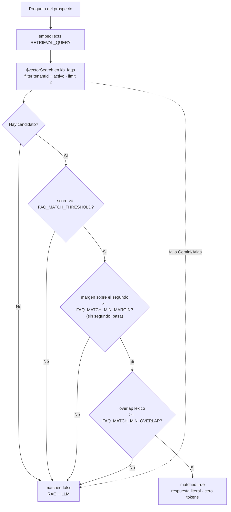

# HU-KB-02-V2 — Matching de FAQ robusto: margen top-2 + overlap léxico (spec)

> **Spec-Driven Development.** Este es el QUÉ y el porqué. El CÓMO va en `plan.md`; la ejecución en
> `tasks.md`. Revisión de `docs/specs/HU-KB-02-faqs-cache/`, que queda intacta como registro de lo
> liberado (mismo precedente que `HU-KB-01-V2` y `HU-KB-01-V3`).
>
> **Rama:** se trabaja sobre `feat/HU-IA-01`, la rama viva de las historias de IA. **No** se crea
> rama nueva.

**Estado:** implementado

## Historia

> Como **prospecto** que escribe por WhatsApp quiero que, cuando Sofi me responda con una respuesta
> escrita a mano por la empresa, **sea la respuesta a MI pregunta** y no la de otra pregunta que
> simplemente hablaba del mismo tema, para no recibir el horario cuando pregunté el precio.

## Contexto: por qué una sola señal no alcanza

`matchFaq` decide si una pregunta se responde con el texto literal del admin (cortocircuito, cero
tokens de generación) o si sigue al flujo normal RAG + LLM. Hoy decide con **una sola señal**: el
score de coseno del **único** candidato que devuelve `faqVectorSearchScoped`
(`numCandidates: 20`, `limit: 1`) contra el umbral global `FAQ_MATCH_THRESHOLD` (0.85 en la escala
normalizada de Atlas `(1 + cos) / 2`, ≈ coseno 0.70).

El problema es de fondo, no de calibración: **el embedding mide cercanía temática, no intención.**
Dos FAQs del mismo dominio comercial —horarios y precios— viven muy cerca en el espacio vectorial,
así que una pregunta como «¿a qué hora abren?» saca score alto contra **ambas**, y basta con que la
ganadora cruce 0.85 para que el prospecto reciba la respuesta equivocada.

| El prospecto pregunta | FAQ ganadora | Score | Hoy |
|---|---|---|---|
| ¿A qué hora abren? | ¿Cuál es el horario de atención? | 0.91 | responde bien ✔ |
| ¿A qué hora abren? | ¿Cuál es el precio del curso? | 0.87 | **responde el precio** ✘ |
| ¿Cuánto cuesta? | ¿Cuál es el horario de atención? | 0.86 | **responde el horario** ✘ |

Subir el umbral no arregla nada: mueve el corte para **todas** las FAQs a la vez, así que apagaría
también los matches buenos. Lo que falta no es un umbral más alto, son **más señales**.

Y el fallo es del peor tipo que puede tener este feature: no es una respuesta pobre que el prospecto
pueda repreguntar, es una respuesta **incorrecta y con toda la seguridad aparente** de haber sido
escrita por la empresa.

## Objetivo

Hacer el cortocircuito robusto frente a esas confusiones **sin gastar un token más**: las dos
señales nuevas son aritmética y texto, cero llamadas adicionales a Gemini en el camino normal.

1. **Margen top-2.** Pedir a Atlas el mejor **y** el segundo candidato, y exigir que el ganador
   supere al segundo por un margen mínimo. Si horarios y precios quedan empatados, el embedding está
   distinguiendo *tema* y no *intención*: no es confiable → RAG + LLM.
2. **Overlap léxico.** Exigir además un mínimo de coincidencia literal de palabras significativas
   entre la pregunta entrante y la de la FAQ candidata. «horarios» y «precios» no comparten ninguna
   → se bloquea aunque el coseno diga lo contrario.
3. **Diagnóstico visible.** El probador del admin (`POST /api/kb/faqs/test`) muestra las tres
   señales con su valor, su mínimo vigente y si pasó, para calibrar con datos reales y no a ojo.

### La asimetría que gobierna el diseño

| | Coste |
|---|---|
| **Falso negativo** (bloqueamos un match bueno) | La pregunta va al RAG + LLM, que la responde igual. Se pagan tokens. |
| **Falso positivo** (dejamos pasar una confusión) | El prospecto recibe una respuesta equivocada, literal, con la firma de la empresa. |

No están ni cerca de costar lo mismo. **Ante la duda, no se cortocircuita.** De ahí que las tres
señales se combinen en **AND estricto** y que los defaults sean severos.

**Coste aceptado, explícito:** una paráfrasis legítima sin palabras compartidas («¿cuánto vale?»
contra la FAQ «¿Cuál es el precio del curso?») deja de cortocircuitar y se va al LLM. Se pierde el
ahorro de tokens en ese caso; no se pierde la respuesta correcta.

## Alcance

### Incluye

- Pipeline `$vectorSearch` de FAQs con **dos** candidatos (`limit: 2`, `numCandidates: 40`),
  conservando intacto todo el núcleo de aislamiento.
- Módulo **puro** `kb-faq.matching.ts`: tokenización del español (sin tildes, sin palabras vacías,
  plural recortado), overlap léxico y evaluación de las tres señales. Sin Mongo, sin red, sin API.
- `matchFaq` decide con el AND de las tres señales, conservando firma y contrato de retorno.
- Dos envs nuevas con sus comentarios de calibración: `FAQ_MATCH_MIN_MARGIN` y
  `FAQ_MATCH_MIN_OVERLAP`.
- `testFaq` y el tipo `FaqTestResult` crecen con el diagnóstico de las tres señales, los tres
  mínimos vigentes y la pregunta del segundo candidato.
- Frontend: `FaqTester` muestra ese diagnóstico; espejo del tipo en `types/faq.ts`.
- Tests: módulo puro nuevo, el caso «horarios vs precios» en el service, y los invariantes de
  aislamiento y degradación que deben seguir verdes.

### Fuera de alcance

- **Re-ranking con el LLM** o cualquier segunda llamada a Gemini en el camino normal: contradice la
  razón de existir del cortocircuito, que es no gastar tokens.
- **Atajo por score muy alto** (aceptar sin overlap cuando el coseno es altísimo). Se evaluó y se
  descartó por ahora: añade una tercera perilla y superficie de falso positivo justo donde el
  diseño decidió ser conservador. Queda anotado como posible V3 si la calibración real muestra que
  se pierden demasiadas paráfrasis.
- Búsqueda por palabras clave en Atlas (`$search` / índice de texto) como tercera señal.
- Sinónimos, lematización de verdad, multi-idioma o cualquier diccionario externo.
- Tocar `FAQ_MATCH_THRESHOLD`, el CRUD de FAQs, el modelo, la validación, el chunking, el RAG de
  HU-KB-01 o la caché exacta de Redis.
- Cambiar el orden de cortocircuitos de `AIService.chat()` o el contrato `FaqMatchResult`.

## Criterios de aceptación

1. **Dos candidatos, aislamiento intacto.** `buildFaqVectorSearchPipeline` pide `limit: 2` con
   `numCandidates` proporcional, y **conserva sin cambios** `filter: { tenantId, activo: true }`, el
   `$match` defensivo posterior con el mismo tenant, el `$addFields` del score y el
   `$project { embedding: 0 }`. El `tenantId` sigue naciendo del argumento, nunca del caller.

2. **Señal de margen.** `matchFaq` solo matchea si
   `scoreMejor − scoreSegundo >= env.FAQ_MATCH_MIN_MARGIN`. **Si no hay segundo candidato** (tenant
   con una sola FAQ activa) la señal **pasa por definición**: sin rival no hay ambigüedad que medir,
   y el tenant que arranca con una sola FAQ no se puede quedar sin cortocircuito.

3. **Señal de overlap léxico.** `matchFaq` solo matchea si la coincidencia literal entre las
   palabras significativas de la pregunta entrante y las de la FAQ candidata alcanza
   `env.FAQ_MATCH_MIN_OVERLAP`. El cálculo es **puro**: normaliza a minúsculas sin diacríticos,
   descarta palabras vacías del español y tokens de menos de 3 caracteres, y tolera el plural
   (`precios` ↔ `precio`) y el prefijo (`hora` ↔ `horario`). No consulta ninguna API.

4. **AND estricto.** `matched === (pasaUmbral && pasaMargen && pasaOverlap)`. Falla cualquiera de
   las tres → `{ matched: false }` y la conversación sigue por el flujo normal RAG + LLM.

5. **El caso raíz queda cubierto.** Con dos FAQs temáticamente cercanas del mismo tenant (horarios y
   precios): la pregunta «¿a qué hora abren?» con score sobre umbral pero margen ínfimo y overlap
   cero devuelve `{ matched: false }`; la misma pregunta con margen y overlap suficientes devuelve
   `{ matched: true }` con la **respuesta literal** de la FAQ y su `confianza`.

6. **Configurabilidad sin valores mágicos.** `FAQ_MATCH_MIN_MARGIN` (default `0.02`) y
   `FAQ_MATCH_MIN_OVERLAP` (default `0.2`) se validan con Zod en `config/env.ts` siguiendo el patrón
   de `FAQ_MATCH_THRESHOLD`, y llevan en el comentario la escala, el porqué del default y cómo
   calibrarlos. Ningún umbral queda escrito a mano en el código.

7. **Degradación intacta.** Ante cualquier fallo (Gemini caído, Atlas sin índice vectorial, error
   del `$vectorSearch`) `matchFaq` sigue devolviendo `{ matched: false }` sin propagar, para que la
   conversación nunca se rompa. La lógica nueva de señales es total: no lanza, no arma expresiones
   regulares con texto del usuario y no depende de nada externo.

8. **Contratos preservados.** `FaqMatchResult { matched, respuesta?, confianza? }` no cambia, el
   `embedding` sigue barrido en la proyección y sin salir por HTTP, y el orden de `AIService.chat()`
   —caché exacta → cortocircuito FAQ → RAG → generación— queda idéntico. `ai.service.ts` y
   `ai-service.types.ts` **no se tocan**.

9. **Probador con diagnóstico.** `POST /api/kb/faqs/test` sigue devolviendo el mejor candidato
   **aunque no supere las señales** y sigue exponiendo el umbral; ahora añade `margenMinimo`,
   `overlapMinimo`, la pregunta del segundo candidato y un objeto `senales` con `score`,
   `segundoScore`, `margen`, `overlap` y los tres booleanos de paso. Su `matched` refleja el AND
   completo, es decir, exactamente lo que haría `matchFaq`. Sigue siendo solo lectura y sigue
   propagando errores para que el admin vea qué falla.

10. **UI del probador en light y dark.** `FaqTester` conserva el medidor con la marca del umbral y
    añade la lectura de las tres señales —valor, mínimo vigente y si pasó—, destacando la que
    bloqueó. Componentes de `src/components/ui/` y tokens semánticos exclusivamente; cero colores
    crudos. Se invocan antes de escribir las skills de diseño del `CLAUDE.md` raíz §7 disponibles en
    la sesión.

11. **Aislamiento multi-tenant (severidad máxima):** el refuerzo no toca el núcleo de aislamiento.
    `kb-faq.repository.ts` sigue siendo el único archivo autorizado a emitir `aggregate` sobre
    `KbFaq`; los tests de pipeline de `kb-faq.repository.test.ts` (tenantId del argumento, string →
    ObjectId, `$match` defensivo, `activo: true` en ambos sitios, `embedding: 0`) siguen verdes sin
    cambiar su intención, y el bloque de aislamiento de `kb-faq.service.test.ts` verifica que ni el
    segundo candidato ni la evaluación de señales pueden traer datos de otro tenant.

12. **Verde:** `pnpm --filter @sofiapp/api typecheck` (`tsc --noEmit`) y
    `pnpm --filter @sofiapp/api test` en verde —el punto de partida son **86 archivos / 850 tests**,
    verificado antes de planear—, más `pnpm --filter @sofiapp/web build && pnpm --filter @sofiapp/web
    lint`. Cero `any`, tipos de retorno explícitos en todo lo exportado.

## Flujo de decisión

**Nota sobre la escala.** Atlas con `similarity: 'cosine'` devuelve el coseno **normalizado a
`(1 + cos) / 2`**. `FAQ_MATCH_MIN_MARGIN = 0.02` está en esa misma escala comprimida y equivale a
≈ `0.04` de coseno crudo. `FAQ_MATCH_MIN_OVERLAP` es una fracción de tokens, escala propia, sin
relación con las anteriores. Los tres se calibran con el probador (criterio 9), nunca a ojo y nunca
tocando código.

## Dependencias

- **Depende de:** HU-KB-02 (feature `kb-faq` completo, índice `kb_faqs_vector`, cableado del
  `FaqMatcher` en `AIService`), HU-KB-01 (`ILlmProvider.embedTexts`), INF-02 (repositorio scoped).
- **Requiere infraestructura:** la ya existente. No hay índice nuevo de Atlas ni migración de datos:
  el `$vectorSearch` solo pide un candidato más del mismo índice.
- **No bloquea a nadie.** Es un endurecimiento de un optimizador ya liberado; si se revirtiera, el
  sistema volvería al comportamiento actual sin romper nada.
