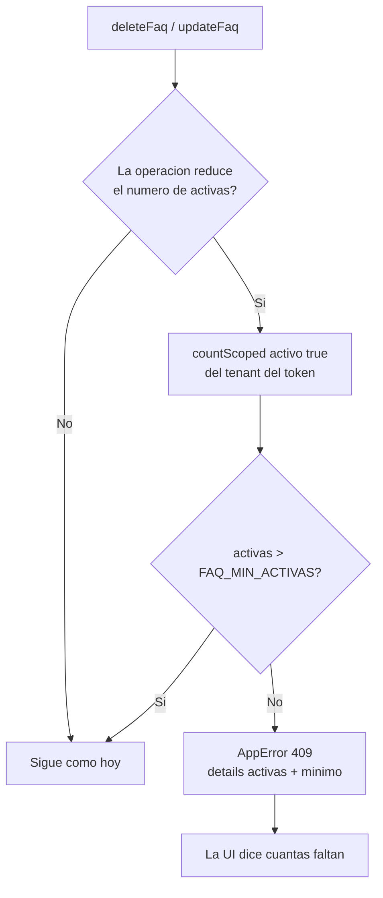

# HU-KB-02-V3 — Mínimo de preguntas frecuentes activas (spec)

> **Spec-Driven Development.** Este es el QUÉ y el porqué. El CÓMO va en `plan.md`; la ejecución en
> `tasks.md`. Tercera revisión del feature `kb-faq`: `HU-KB-02` lo creó, `HU-KB-02-V2` endureció el
> matching, y esta pone un piso a cuántas FAQs activas debe sostener un tenant.
>
> **Rama:** se trabaja sobre `feat/HU-IA-01`, la rama viva de las historias de IA/KB. **No** se crea
> rama nueva.

**Estado:** implementado

## Historia

> Como **dueño del producto** quiero que ninguna empresa opere con menos de cinco preguntas
> frecuentes activas, para que el cortocircuito de FAQ tenga con qué trabajar y Sofi no dependa
> enteramente del modelo para lo que más le preguntan.

## Contexto: por qué un piso y no una sugerencia

Hoy el módulo acepta cualquier cantidad, cero incluida. Un tenant puede desactivar sus FAQs una a
una hasta dejar el cortocircuito sin nada que devolver, y nada en la interfaz avisa de que eso tiene
un costo: cada pregunta repetida vuelve a pagarse en tokens y en latencia. El feature está
construido para ahorrar, y sin FAQs activas no ahorra nada.

Una sugerencia («te recomendamos tener cinco») no cambia el comportamiento de nadie. Un piso sí, y
además es barato de sostener: la regla vive en dos operaciones y se apoya en un conteo que ya está
indexado por `tenantId`.

## Objetivo

1. **Bloquear en el servidor** toda operación que dejaría al tenant con menos activas de las
   exigidas: desactivar una FAQ activa y eliminar una FAQ activa.
2. **No bloquear nunca** lo que no reduce el conteo: crear, editar el texto de una pregunta o su
   respuesta, reactivar una FAQ apagada, o eliminar una que ya estaba inactiva.
3. **Mostrarlo en la interfaz** antes de que el admin choque: el conteo `X de 5 activas`, los
   controles inertes con su motivo, y un aviso mientras el tenant esté por debajo.

## Semántica del bloqueo: piso duro

La guarda se evalúa **antes** de la operación y compara el conteo actual contra el mínimo:

| Activas ahora | Acción | Resultado |
|---|---|---|
| 6 | desactivar / eliminar una activa | ✅ queda en 5 |
| 5 | desactivar / eliminar una activa | ❌ `409` |
| 3 *(datos previos)* | desactivar / eliminar una activa | ❌ `409` |
| cualquiera | **crear** | ✅ siempre |
| cualquiera | **editar** pregunta o respuesta | ✅ siempre |
| cualquiera | **reactivar** una apagada | ✅ siempre |
| cualquiera | **eliminar una ya inactiva** | ✅ no baja el conteo |

Es decir: se permite la baja solo si `activas > mínimo`.

**Un tenant por debajo del mínimo no queda atrapado, y la salida es editar.** Si una de sus tres
FAQs tiene información equivocada, la reescribe en el sitio —pregunta y respuesta— sin necesidad de
borrarla; y sube a cinco escribiendo, no borrando. Se eligió este piso duro sobre la alternativa de
«solo proteger el escalón 5→4» porque esa dejaba que un tenant con cuatro activas bajara hasta cero
sin que nada lo frenara, con lo que el mínimo dejaba de ser un mínimo.

## Alcance

### Incluye

- Env `FAQ_MIN_ACTIVAS` (default `5`) validada con Zod, siguiendo el patrón del bloque FAQ de
  `config/env.ts`. Con `0` la regla queda desactivada por completo, sin tocar código.
- Guarda en `kb-faq.service.ts` sobre `deleteFaq` y sobre `updateFaq` cuando `activo` pasa de `true`
  a `false`, con conteo vía `countScoped`.
- `AppError` con código `409` y `details: { activas, minimo }`, para que la interfaz pueda decir
  cuántas faltan sin volver a preguntar.
- `KbFaqsListResponse` gana `activas` y `minimoActivas`, de alcance **tenant** y no de página.
- Frontend: contador en la cabecera de la tabla, interruptor y borrado inertes con su motivo en un
  `Tooltip`, el mismo interruptor gobernado en `FaqFormDialog`, y un aviso en la página mientras el
  tenant no llegue al mínimo.
- Tests de servicio, de aislamiento, de rutas y de los dos componentes.

### Fuera de alcance

- **Migración o backfill de datos.** Los tenants que hoy están por debajo se quedan como están; la
  regla solo gobierna operaciones nuevas.
- **Sembrar FAQs de oficio** para llevar a un tenant al mínimo. `HU-KB-02` ya decidió que aquí no
  hay presets: las escribe el admin.
- **Bloquear otras partes del producto** mientras el tenant esté por debajo (no se apaga el
  asistente, no se corta el onboarding, no se degrada nada). El piso gobierna el módulo de FAQs y
  nada más.
- Un mínimo distinto por plan o por tenant: la env es global al despliegue.
- Garantía transaccional entre dos administradores borrando a la vez (ver `plan.md`, Notas).
- Tocar el matching de `HU-KB-02-V2`, el CRUD de documentos KB, el RAG o la caché.

## Criterios de aceptación

1. **Bloqueo al desactivar:** con `activas === FAQ_MIN_ACTIVAS`, `updateFaq` con `{ activo: false }`
   sobre una FAQ activa lanza `AppError` con `statusCode 409` y `details { activas, minimo }`. El
   documento **no** cambia en Mongo.

2. **Bloqueo al eliminar:** con `activas === FAQ_MIN_ACTIVAS`, `deleteFaq` sobre una FAQ **activa**
   lanza el mismo `409` y la FAQ sigue existiendo.

3. **Permitido por encima del mínimo:** con `activas > FAQ_MIN_ACTIVAS`, desactivar y eliminar
   funcionan como hoy y dejan el conteo exactamente en el mínimo.

4. **Lo que no reduce el conteo nunca se bloquea:** crear (con cualquier conteo, cero incluido),
   editar solo `pregunta` y/o `respuesta`, reactivar una FAQ apagada, enviar `{ activo: false }`
   sobre una que ya estaba inactiva, y **eliminar una FAQ inactiva** aunque el tenant esté justo en
   el mínimo.

5. **Piso duro con datos previos:** un tenant con menos activas que el mínimo sigue bloqueado para
   bajar más, y sigue pudiendo crear y editar sin restricción alguna.

6. **Regla desactivable:** con `FAQ_MIN_ACTIVAS=0` ninguna operación se bloquea. La decisión vive en
   una función pura, verificable sin levantar Mongo ni depender del valor del entorno.

7. **Conteo de alcance tenant en el listado:** `GET /api/kb/faqs` devuelve `activas` y
   `minimoActivas`. `activas` cuenta **todas** las FAQs activas del tenant, con independencia de
   `page`, `limit` y del filtro `activo` — a diferencia de `total`, que sí responde al filtro.

8. **Capas en su sitio:** la regla vive en el `service`. El controller sigue delgado, sin
   `try/catch` ni lógica, y los schemas Zod siguen validando **forma** y no estado del negocio —
   ningún schema aprende a contar FAQs.

9. **La interfaz refleja el límite antes del choque:** la tabla muestra `X de N activas`; con
   `activas <= minimoActivas` el interruptor de una FAQ activa y su botón de eliminar quedan
   deshabilitados, con la razón accesible en un `Tooltip` alcanzable por teclado; el interruptor de
   `FaqFormDialog` se gobierna igual. La UI **no** es la defensa: el backend rechaza igual.

10. **Aviso mientras falten:** con `activas < minimoActivas` la página muestra un aviso que dice
    cuántas faltan y ofrece crear una. Desaparece al alcanzar el mínimo. Todo en componentes de
    `src/components/ui/` y tokens semánticos, terminado en **light y dark**.

11. **Aislamiento multi-tenant (severidad máxima):** el conteo pasa por `countScoped` y el
    `tenantId` nace de `req.user!.tenantId`, nunca del body/params/query. **Test de aislamiento:**
    con el tenant A por encima del mínimo y el tenant B justo en él, A puede eliminar y B no; y a la
    inversa, el conteo de A nunca habilita ni bloquea una operación de B.

12. **Verde:** `pnpm --filter @sofiapp/api typecheck` (`tsc --noEmit`) y
    `pnpm --filter @sofiapp/api test` en verde —punto de partida verificado antes de planear:
    **87 archivos / 879 tests**—, más `pnpm --filter @sofiapp/web test`, `build` y `lint`. Cero
    `any`, tipos de retorno explícitos.

## Flujo de la guarda

Reducen el conteo exactamente dos casos: eliminar una FAQ con `activo: true`, y actualizar una FAQ
activa con `{ activo: false }`. Todo lo demás entra por la rama «No».

## Dependencias

- **Depende de:** `HU-KB-02` (feature `kb-faq` completo, `FaqTable`, `FaqFormDialog`,
  `KnowledgeFaqsPage`), `INF-02` (`countScoped` y el `tenantId` del token).
- **Requiere infraestructura:** ninguna. Sin índice nuevo, sin migración, sin cambios de despliegue
  más allá de la env opcional.
- **No bloquea a nadie.** Poner `FAQ_MIN_ACTIVAS=0` devuelve el comportamiento actual sin desplegar
  código.
