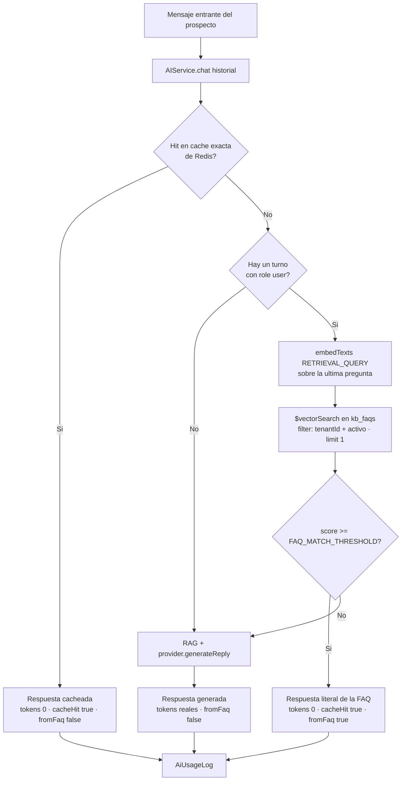

# HU-KB-02 — FAQs con ahorro de tokens (spec)

> **Spec-Driven Development.** Este es el QUÉ y el porqué. El CÓMO va en `plan.md`; la ejecución en
> `tasks.md`. HU-KB-01 dio a la IA *contexto* que siempre consume tokens; HU-KB-02 añade pares
> pregunta→respuesta que **cortocircuitan** al LLM cuando la consulta es una repetida de siempre.

**Estado:** implementado

## Historia

> Como **Administrador** quiero **cargar preguntas frecuentes (FAQ) como pares estructurados de
> pregunta + respuesta** para que **las consultas repetitivas se respondan por coincidencia
> semántica sin invocar el modelo de IA, ahorrando tokens y mejorando la latencia.**

## Objetivo

1. **CRUD de FAQs** por tenant: pares `pregunta` / `respuesta`, con un `embedding` de la pregunta
   generado automáticamente al crear y al editarla.
2. **Matching semántico tenant-safe** (`matchFaq`) que, sobre un umbral configurable, devuelve la
   respuesta literal del admin **sin llamar al LLM** (`totalTokens: 0`).
3. **Herramienta de calibración**: el admin puede probar una pregunta desde la UI y ver el mejor
   candidato con su score, aunque quede por debajo del umbral, para afinar `FAQ_MATCH_THRESHOLD`
   con datos en vez de a ojo.

### Diferencia con HU-KB-01

| | HU-KB-01 (documentos) | HU-KB-02 (FAQs) |
|---|---|---|
| Unidad | Texto libre troceado en chunks | Par pregunta → respuesta |
| Uso | Contexto que se inyecta al prompt | Respuesta final servida tal cual |
| Coste | **Siempre** consume tokens del LLM | **Cero** tokens de generación si hay match |
| Indexado | Asíncrono (worker `kb-index`) | Síncrono en el service (1 solo texto) |
| Origen de la respuesta | Generada por Gemini | Literal, escrita por el admin |

## Alcance

### Incluye

- Feature backend `kb-faq` completo (patrón de 6 archivos + repositorio vectorial): modelo con
  `tenantId`, `pregunta`, `respuesta`, `embedding`, `activo` y timestamps; índice único
  `{ tenantId, pregunta }`.
- Endpoints `GET/POST /api/kb/faqs`, `PATCH/DELETE /api/kb/faqs/:id` y `POST /api/kb/faqs/test`,
  todos rol `admin`.
- Índice de Atlas Vector Search `kb_faqs_vector` (filtros `tenantId` + `activo`) y su script de
  creación idempotente.
- `matchFaq(tenantId, pregunta)` — embedding de la pregunta entrante + `$vectorSearch` sobre las
  FAQs activas del tenant.
- Integración con `AIService`: un `FaqMatcher` **inyectado por constructor** que cortocircuita
  `chat()`; campo `fromFaq` en `AiResult` y en `AiUsageLog`.
- Envs `FAQ_VECTOR_INDEX` y `FAQ_MATCH_THRESHOLD` validadas con Zod en `config/env.ts`.
- Frontend: ruta `/settings/knowledge/faqs` como sub-ítem del sidebar bajo «Base de Conocimiento»,
  con tabla, formulario en diálogo y probador de FAQ.

### Fuera de alcance

- **«FAQ sugerida»** cuando el score queda bajo umbral (solo se expone en el probador manual, no en
  el flujo de conversación).
- Importación masiva de FAQs (CSV/JSON) y FAQs predefinidas — **no hay presets**: el admin las crea
  a mano, una a una.
- Conectar el auto-reply real: `AIService.chat()` aún no tiene consumidores en producción (el gancho
  está pendiente en `workers/inbound-message.processor.ts`, `TODO(Fase 3)`). Aquí se construye el
  cortocircuito, no quien lo dispara.
- Analítica del ahorro de tokens (el campo `fromFaq` en `AiUsageLog` deja los datos listos, pero el
  dashboard es otra HU).
- Multi-idioma, versionado / historial de cambios de FAQs, y reordenamiento por prioridad manual.
- Cambios en el chunking, en el pipeline de documentos o en la caché exacta de Redis.

## Criterios de aceptación

1. **CRUD tenant-safe:** `GET /api/kb/faqs` (paginado), `POST /api/kb/faqs`, `PATCH /api/kb/faqs/:id`
   y `DELETE /api/kb/faqs/:id` responden solo a rol `admin` con la cadena de middlewares en orden
   fijo (`authenticateJWT → requireTenant → authorize(['admin']) → validate → asyncHandler`). Una
   FAQ inexistente en el tenant produce `AppError('No se encontró la pregunta frecuente.', 404)`.

2. **Embedding automático:** al crear una FAQ, y al editarla **solo si cambia el texto de
   `pregunta`**, el service llama `provider.embedTexts({ texts: [pregunta], taskType:
   'RETRIEVAL_DOCUMENT' })` y persiste el vector resultante. Editar únicamente `respuesta` o
   `activo` **no** vuelve a llamar a Gemini.

3. **Unicidad por tenant:** el modelo declara `{ tenantId: 1, pregunta: 1 }` único; intentar crear o
   renombrar hacia una pregunta ya existente en ese tenant responde
   `AppError('Ya existe una pregunta frecuente con ese texto.', 409)`, no un error 500 de Mongo.

4. **El `embedding` nunca sale por HTTP:** `IKbFaqResponse` no lo declara, el mapper no lo copia y el
   pipeline de búsqueda proyecta `{ embedding: 0 }`. Ninguna respuesta de la API contiene vectores.

5. **Matching sobre umbral:** `matchFaq(tenantId, pregunta)` embebe la pregunta con
   `taskType: 'RETRIEVAL_QUERY'` y consulta `$vectorSearch` con
   `filter: { tenantId, activo: true }` y `limit: 1`. Devuelve
   `{ matched: true, respuesta, confianza }` si `score >= env.FAQ_MATCH_THRESHOLD`, y
   `{ matched: false }` en caso contrario. Una FAQ con `activo: false` **nunca** puede matchear.

6. **Cortocircuito real:** cuando hay match, `AIService.chat()` **no** invoca
   `provider.generateReply` y retorna `{ data: <respuesta de la FAQ>, cacheHit: true, fromFaq: true,
   promptTokens: 0, completionTokens: 0, totalTokens: 0, durationMs }`. Si no hay match, o si el
   historial no contiene ningún turno con `role: 'user'`, el flujo normal (RAG + LLM) queda intacto.

7. **Orden de cortocircuitos:** caché exacta de Redis → FAQ → LLM. El match de FAQ ocurre **después**
   del `getCached` y **antes** del `generateReply`, de modo que un hit de caché no gasta ni un
   embedding. Toda respuesta servida desde FAQ queda registrada en `AiUsageLog` con `fromFaq: true`
   y tokens en cero.

8. **Probador de FAQ:** `POST /api/kb/faqs/test` con `{ pregunta }` devuelve el mejor candidato
   **aunque esté por debajo del umbral**, incluyendo `matched`, `confianza`, `umbral` y la
   `pregunta` de la FAQ candidata, para que el admin pueda calibrar `FAQ_MATCH_THRESHOLD`. Es una
   herramienta de diagnóstico: **no** escribe nada ni afecta al flujo de conversación.

9. **UI completa en light y dark:** la ruta `/settings/knowledge/faqs` está protegida con
   `RequireRole roles={['admin']}` y aparece como sub-ítem de «Base de Conocimiento» en el sidebar.
   Muestra tabla con columnas `Pregunta`, `Respuesta` (truncada), `Activa` y Acciones
   (`Pencil` / `Trash2` con `aria-label` y estado `disabled` durante mutaciones), un formulario en
   `Dialog` con `Input` de pregunta + `Textarea` de respuesta + `Switch` de activo, y el probador
   con su score. *(Ajuste durante la implementación: la columna `Activa` usa un `Switch` en vez de
   un `Badge`. Comunica el mismo estado y además permite silenciar una FAQ sin abrir el diálogo; la
   fila inactiva se atenúa para reforzar la lectura.)* Se usan **exclusivamente** componentes de `src/components/ui/` y tokens semánticos
   de Tailwind — cero colores crudos, cero `<table>` a mano.

10. **Aislamiento multi-tenant (severidad máxima):** todo acceso a Mongo pasa por el repositorio
    scoped (`findScoped`, `findByIdScoped`, `createScoped`, `findOneAndUpdateScoped`,
    `findOneAndDeleteScoped`, `countScoped`) o por `kb-faq.repository.ts`, único archivo autorizado
    a emitir `aggregate` sobre `KbFaq`; el `tenantId` nace siempre de `req.user!.tenantId`, nunca del
    body/params/query. El pipeline lleva `filter.tenantId` **y** un `$match` defensivo posterior.
    **Test de aislamiento:** un tenant no puede leer, editar ni borrar una FAQ de otro tenant
    (responde 404), y `matchFaq` de un tenant nunca devuelve la respuesta de otro.

11. **Verde:** `pnpm --filter @sofiapp/api typecheck` (`tsc --noEmit`) y
    `pnpm --filter @sofiapp/api test` en verde; `pnpm --filter @sofiapp/web build && pnpm --filter
    @sofiapp/web lint` en verde.

## Flujo de matching FAQ

**Nota sobre la escala del score.** Atlas Vector Search con `similarity: 'cosine'` devuelve el
coseno **normalizado a `(1 + cos) / 2`**, no el coseno crudo. El default `FAQ_MATCH_THRESHOLD=0.85`
equivale por tanto a un coseno de ≈ `0.70`. Es un punto de partida razonable, pero la calibración
real se hace con el probador (criterio 8) y ajustando la variable de entorno — nunca el código.

## Dependencias

- **Depende de:** HU-KB-01 (pipeline de embeddings Gemini vía `ILlmProvider.embedTexts`, patrón de
  `$vectorSearch` de `kb.repository.ts`, script de creación de índices de Atlas), HT-AI-01
  (`ILlmProvider`, `AIService` con caché exacta, `AiUsageLog`), INF-02 (middleware de tenant +
  repositorio scoped).
- **Requiere infraestructura:** MongoDB Atlas **M10+** (Vector Search no existe en tiers gratuitos)
  y el índice `kb_faqs_vector` creado en el entorno destino antes de que `matchFaq` sea útil.
- **Bloqueante de:** la HU que conecte el auto-reply de Sofi en
  `workers/inbound-message.processor.ts` — será quien haga visible el ahorro end-to-end.
